# 📊 GitHub README Stats (Custom)

Genera tarjetas SVG dinámicas y personalizables con tus estadísticas de GitHub para mostrar en tu perfil o en el `README.md` de cualquier repositorio: estadísticas generales, lenguajes más usados, racha de contribuciones y una gráfica de actividad — todo con un diseño oscuro, moderno y 100% personalizable.

<p align="center">
  
  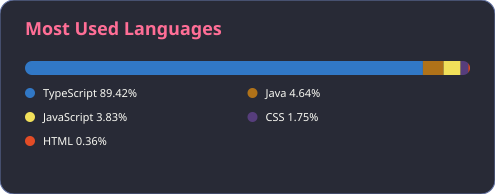
</p>
<p align="center">
  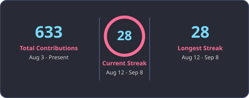
</p>
<p align="center">
  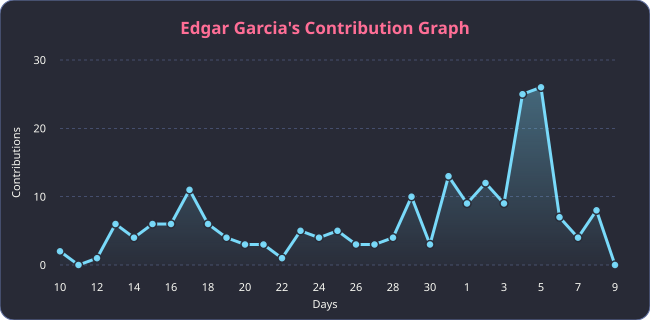
</p>

---

## ✨ Características

- 🟣 **4 tarjetas independientes**: Stats, Most Used Languages, Streak Stats y Contribution Graph.
- 🎨 **57 temas** predefinidos (`dracula`, `radical`, `tokyonight`, `github_dark`, `nord`, etc.) o colores 100% a tu gusto.
- 🔘 **`border_radius` configurable** en todas las tarjetas.
- 🖼️ **Iconos activables/desactivables** en la tarjeta de Stats.
- 🧩 Endpoint `all` para combinar las 4 tarjetas en una sola imagen.
- ⚡ Backend en Express, listo para correr local o desplegar en Vercel.

---

## 🚀 Instalación y uso local

```bash
git clone <tu-fork-o-repo>
cd README-STATS-main
npm install
cp .env.example .env
```

Edita `.env` y agrega un [token de GitHub](https://github.com/settings/tokens) con permisos `public_repo` (o `repo` para estadísticas de repos privados):

```env
GITHUB_TOKEN=tu_token_aqui
PORT=3000
```

Inicia el servidor:

```bash
npm start
```

El servidor queda disponible en `http://localhost:3000`. Los endpoints de la API son:

```
GET /api/card/stats?username=<usuario>
GET /api/card/languages?username=<usuario>
GET /api/card/streak?username=<usuario>
GET /api/card/contributions?username=<usuario>
GET /api/card/all?username=<usuario>
```

---

## 🖥️ Interfaz web (Frontend)

Además de la API, el proyecto incluye un **frontend** (carpeta `ui/`) que te deja generar tus tarjetas sin tocar código ni armar URLs a mano. Puedes probarlo ya desplegado aquí:

👉 **[readme-stats-two-rouge.vercel.app](https://readme-stats-two-rouge.vercel.app/)**

O correrlo en local: con el servidor encendido (`npm start`), abre `http://localhost:3000` en el navegador — Express sirve automáticamente `ui/index.html`.

**¿Qué puedes hacer desde ahí?**

1. **GitHub Username** → escribe el usuario del que quieres generar las tarjetas.
2. **Theme** → elige uno de los temas disponibles desde el selector (Default, Dark, Radical, Tokyo Night, One Dark, Cobalt, Gruvbox, Dracula, Monokai, Nord, Gotham, Material Palenight, GitHub Dark, Blue Navy, Aura Dark, Vision Friendly Dark, entre otros).
3. **Pestañas de tarjeta** → cambia entre `Stats Card`, `Languages Card`, `Streak Card` y `Contributions` para previsualizar cada una.
4. **Generate Card** → renderiza la tarjeta en vivo con los datos reales del usuario.
5. **Copy Markdown** → copia al portapapeles el snippet `` ya armado con tu usuario y tema, listo para pegar en tu README.

Es la forma más rápida de armar la URL correcta sin memorizar los parámetros de la API — y una vez que tengas la combinación que te gusta, puedes seguir ajustándola a mano (colores, `border_radius`, `hide_icons`, etc.) usando las secciones de abajo como referencia.

> Si despliegas tu propio fork en Vercel, el frontend viaja incluido: apuntará automáticamente a los endpoints `/api/card/*` de tu mismo despliegue.

---

### Despliegue

El proyecto incluye `vercel.json`, así que puedes desplegarlo directamente en [Vercel](https://vercel.com) (recuerda configurar la variable de entorno `GITHUB_TOKEN` en el panel del proyecto). Una vez desplegado, reemplaza `http://localhost:3000` por tu dominio (ej. `https://tu-proyecto.vercel.app`) en todos los ejemplos de este README.

---

## 🖼️ Cómo insertar las tarjetas en tu README

Simplemente agrega una imagen apuntando a tu API desplegada:

```markdown

```

### Ejemplo: Stats Card

```markdown

```

Muestra: total de estrellas, commits del último año, PRs, issues, repos a los que contribuiste, y un anillo con tu **rank** (S, A+, A, A-, B+, B, B-, C+, C).

### Ejemplo: Languages Card

```markdown

```

| Parámetro     | Descripción                                   | Default |
| ------------- | ---------------------------------------------- | ------- |
| `langs_count` | Cuántos lenguajes mostrar en la leyenda        | `6`     |

### Ejemplo: Streak Card

```markdown

```

Muestra el total de contribuciones, la racha actual (con anillo de progreso) y la racha más larga.

### Ejemplo: Contribution Graph

```markdown

```

| Parámetro | Descripción                                | Default |
| --------- | -------------------------------------------- | ------- |
| `days`    | Cuántos días recientes graficar (línea/área) | `31`    |

### Combinar todas las tarjetas en una sola imagen

```markdown

```

`all` apila las 4 tarjetas verticalmente en una única imagen SVG. Si prefieres organizarlas en cuadrícula (como en la vista previa de arriba), usa los endpoints individuales dentro de una tabla de Markdown/HTML:

```markdown
<table>
  <tr>
    <td></td>
    <td></td>
  </tr>
</table>

```

---

## 🎨 Temas (`theme`)

Todas las tarjetas aceptan `?theme=<nombre>`. Por defecto se usa `dracula`. Consulta la lista completa (con sus colores) en:

```
GET /api/themes
```

Algunos de los 57 temas disponibles:

`default` · `dark` · `radical` · `merko` · `gruvbox` · `gruvbox_light` · `tokyonight` · `onedark` · `cobalt` · `synthwave` · `highcontrast` · `dracula` · `monokai` · `nord` · `gotham` · `github_dark` · `github_dark_dimmed` · `catppuccin_mocha` · `catppuccin_latte` · `rose_pine` · `nightowl` · `panda` · `aura` · `holi` · `neon` · `outrun` · `city_lights` · `swift` · ... [ver el resto en `api/themes.cjs`]

<p align="center">
  
  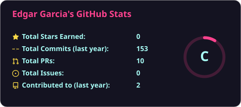
</p>
<p align="center">
  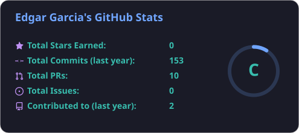
  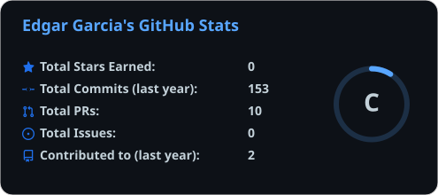
</p>
<p align="center">
  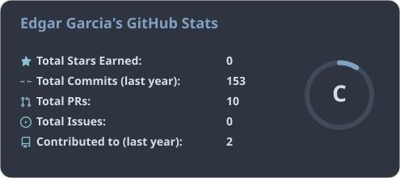
  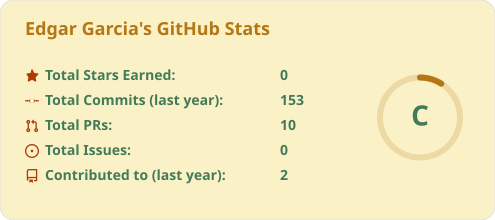
</p>

### Colores personalizados

Si no quieres usar un tema predefinido, puedes sobreescribir cada color manualmente (sin el símbolo `#`):

```markdown

```

| Parámetro      | Qué colorea                                                  |
| -------------- | -------------------------------------------------------------- |
| `title_color`  | Título de la tarjeta                                          |
| `text_color`   | Texto general (etiquetas, valores, fechas)                    |
| `icon_color`   | Iconos y acentos (números grandes de racha, línea de la gráfica) |
| `bg_color`     | Fondo de la tarjeta                                            |
| `border_color` | Borde de la tarjeta                                            |
| `ring_color`   | Anillos de progreso (rank y racha actual)                      |

Cualquier color que pases explícitamente tiene prioridad sobre el `theme` elegido — puedes usar un tema como base y sobreescribir solo un color puntual.

---

## 🔘 `border_radius`

Controla el redondeo de las esquinas de la tarjeta (en píxeles). Por defecto es `14`.

```markdown


```

<p align="center">
  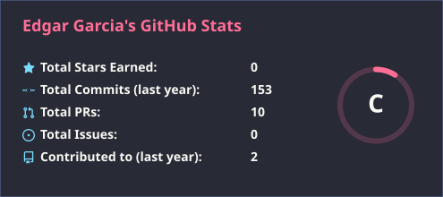
  
  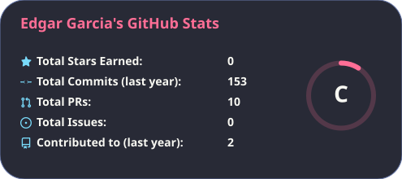
</p>

Funciona igual en las 4 tarjetas (`stats`, `languages`, `streak`, `contributions`).

---

## 🖼️ Activar o desactivar iconos (`hide_icons`)

La Stats Card incluye un pequeño ícono junto a cada fila (⭐ estrellas, commits, PRs, issues, contribuciones). Puedes ocultarlos con `hide_icons=true`:

```markdown


```

<p align="center">
  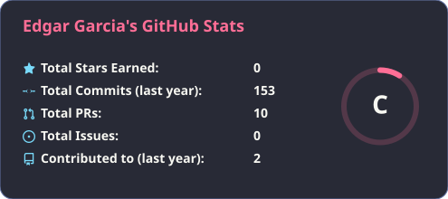
  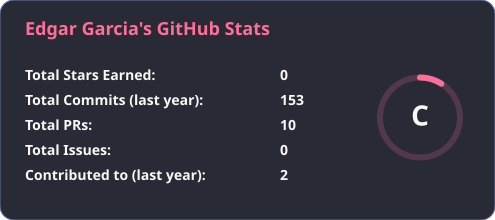
</p>

---

## ⚙️ Referencia completa de parámetros

Parámetros comunes a **todas** las tarjetas:

| Parámetro       | Tipo    | Descripción                                             | Default     |
| --------------- | ------- | -------------------------------------------------------- | ----------- |
| `username`      | string  | **Requerido.** Usuario de GitHub                         | —           |
| `theme`         | string  | Nombre del tema (ver `/api/themes`)                       | `dracula`   |
| `title_color`   | hex     | Color del título (sin `#`)                                | según tema  |
| `text_color`    | hex     | Color del texto                                           | según tema  |
| `icon_color`    | hex     | Color de iconos/acentos                                   | según tema  |
| `bg_color`      | hex     | Color de fondo                                             | según tema  |
| `border_color`  | hex     | Color del borde                                            | según tema  |
| `ring_color`    | hex     | Color de los anillos de progreso                           | según tema  |
| `border_radius` | número  | Radio de las esquinas en px                                | `14`        |

Parámetros específicos:

| Endpoint                | Parámetro     | Descripción                                    | Default |
| ------------------------ | ------------- | ------------------------------------------------ | ------- |
| `/api/card/stats`        | `hide_icons`  | `true` para ocultar los iconos de cada fila       | `false` |
| `/api/card/languages`    | `langs_count` | Cantidad de lenguajes a mostrar                   | `6`     |
| `/api/card/contributions`| `days`        | Cantidad de días recientes a graficar             | `31`    |

---

## 🧠 Cómo se calcula el rank

El anillo de la Stats Card (S, A+, A, A-, B+, B, B-, C+, C) se calcula con un puntaje ponderado sobre: commits del último año, pull requests, issues, estrellas totales y repos a los que contribuiste — cuanto mejor el percentil, más alto el rango. La lógica vive en `api/cards/stats.cjs` (`calculateRank`) y puedes ajustar los pesos ahí si quieres una escala distinta.

---

## 📁 Estructura del proyecto

```
api/
  index.js            → Rutas Express (/api/card/*)
  card.js              → Fetch de datos desde la API de GitHub
  github.js            → Cliente GraphQL/REST de GitHub
  themes.cjs            → Definición de los 57 temas
  cards/
    stats.cjs            → Tarjeta de estadísticas + rank
    languages.cjs         → Tarjeta de lenguajes más usados
    streak.cjs             → Tarjeta de racha de contribuciones
    contributions.cjs       → Gráfica de contribuciones
ui/                    → Frontend simple para generar tus tarjetas visualmente
docs/examples/         → SVGs de ejemplo usados en este README
```

---

## 🛠️ Solución de problemas

- **"Missing username parameter"** → agrega `?username=tu_usuario` a la URL.
- **Rate limit / 401** → revisa que `GITHUB_TOKEN` esté configurado en `.env` (o en las variables de entorno de tu despliegue) y que el token no haya expirado.
- **Las imágenes no se actualizan en GitHub** → GitHub cachea las imágenes de los README; agrega un parámetro random (`&cache=123`) o espera unos minutos.

---

## 📄 Licencia

Este proyecto está pensado como una plantilla personal/educativa inspirada en [github-readme-stats](https://github.com/anuraghazra/github-readme-stats). Úsalo y modifícalo libremente para tu propio perfil.
